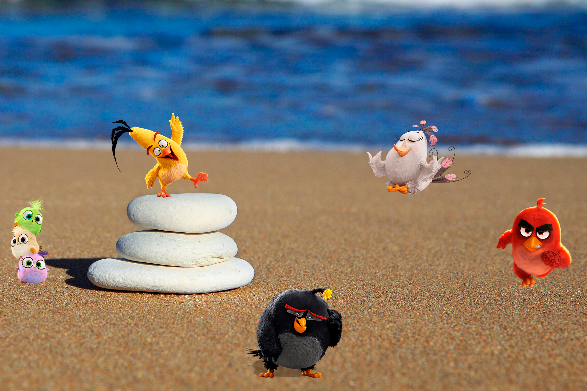

# Ejercicio-Flex

Ejercicio básico de Flexbox:

1- Representa la escena acomodando a los personajes en la playa. Recuerda pensar en los contenedores de estos elementos como cajas para poder mover los ítems.
2- Además, ten en cuenta que la imagen de fondo es justamente eso: un background-image.
3- Debe estar posicionado con Flexbox (excluyente).

